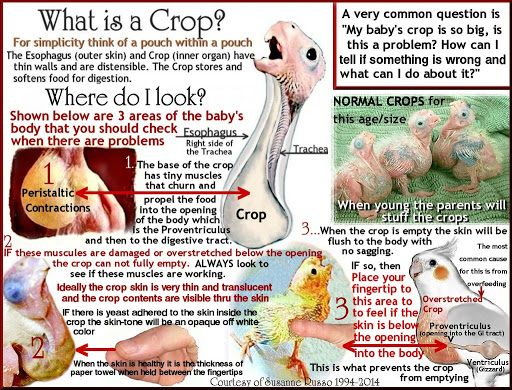

# 健身的人可以喝土豚奶？！

## Video



## Subtitle

Narrator: Imagine feeding your baby a milkshake for every meal.

Well, for hooded seal pups, that's nothing.

Their mother's milk contains 60% fat, the fattiest milk in the world.

For comparison, the richest ice cream **clocks in at** only 16% fat.

And after just three to five days guzzling the stuff, seal pups double their body weight.

But seals aren't the only animals with extreme milk.

If hooded seals drink the fattiest milk, then tammar wallabies prefer their milk loaded with sugar.

It can contain as much as 12% sugar, more than a glass of Coca-Cola, and for good reason.

Joeys are born prematurely and finish developing outside the womb.

And since sugars are easier to digest than fat, their milk is easier on their developing digestive systems.

Meanwhile, the milk also contains an antibiotic more powerful than penicillin, which protects the young joeys from germs since they're born without a fully functioning immune system.

Meanwhile, aardvark milk doesn't contain much sugar, but it makes up for it with extreme levels of protein.

While cow's milk has a measly 3 to 4% protein, aardvark milk can contain over 13%, making it among the highest-protein milks on earth, giving calves enough nutrition to reach 30% of their adult weight in just three months.

But while aardvarks have some pretty potent milk, nine-banded armadillos make some special stuff of their own.

By the time the pups are a month old, they're drinking milk that contains 10 times as much calcium as cow's milk.

All this calcium helps the pups develop those famous armor shells, which are actually made of bone.

Next up, flamingos.

That's right, flamingos.

Like most birds, they feed their chicks by vomiting directly into their mouths, but that food isn't made of the day's catch.

Instead, it consists of a substance called crop milk because it's stored in the parent's crop, and flamingos are one of only three birds that can produce this stuff.

But even among our feathered friends, flamingo crop milk is special because it's pink.

That's because the pigments that give flamingos their brilliant coloring leach out of their feathers and into the milk.

Now, all this milk might sound like the next health-food craze, but there's a good reason we generally stick to plain old cattle: They're much easier to milk.

## Vocabulary

pup   
n.（動物）幼獸

prematurely  
adv.不成熟地；倉促地；過早地

guzzle   
v.濫吃；狂飲；狼吞虎嚥

calcium  
n. 鈣質

antibiotic  
n.抗生素

pigment  
n.色素

flamingo   
n.紅鶴

crop   
n.嗉囊

## Phrase

**clock in at**   
剛好包含、正好有 \(時間或不可數名詞的數量\)  
The film **clocks in at** nearly three hours; I won't have time to watch it.   
這部電影總長有三小時，我不會有時間看。

